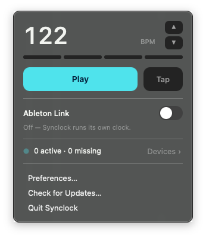

# Synclock

**A native macOS menubar master MIDI clock + Ableton Link.** Sync your hardware
and software to one tight clock without opening a DAW. Free, native, open source.

**[synclock.caiano.com](https://synclock.caiano.com)**

<p align="center">
  
</p>

## Download
**[Download Synclock for macOS](https://github.com/hcaiano/synclock/releases/latest)**

Open the `.dmg`, drag Synclock to Applications, and launch it. It lives in the
menu bar and updates itself.

> macOS 13 or later · Apple Silicon.

## What it does (v1)
- Master **MIDI clock** (`0xF8` @ 24 PPQN) + transport (Start / Stop / Continue) to
  any connected gear and a named **virtual port**.
- **Ableton Link** — a single on/off toggle; when on, Synclock shares one tempo and
  downbeat with every Link app and device on the network, with a live peer count.
- **Works with any gear**: per-device enable, nickname, sync delay (ms),
  clock-vs-transport, live status. New devices default **off** for live safety.
- Decimal BPM (30–300) + fine nudge + tap tempo.
- A hand-owned, timestamped CoreMIDI scheduler — the clock is meant to feel *tight*.

## Build from source
For developers. Most people should just [download the app](#download). Requires Swift 5.9+ (macOS 13+).

```sh
swift build             # builds the app + C-ABI Link bridge
swift run synclock      # launch the menubar agent
swift run SynclockTests # dependency-free test runner
```

The `AbletonLinkBridge` target vendors Ableton Link 4.0 under
`ThirdParty/ableton-link` and exposes it to Swift through a small C ABI (see
[`ThirdParty/README.md`](ThirdParty/README.md)).

## License
**GPLv2-or-later** (see [`LICENSE`](LICENSE)) — required because Synclock links the
Ableton Link C++ source. The **Synclock name, logo, and brand assets are reserved
Caiano brand assets**, not covered by the GPL.

Free, with an optional [Buy Me a Coffee](https://buymeacoffee.com/caiano).

Copyright © 2026 Henrique Caiano.
